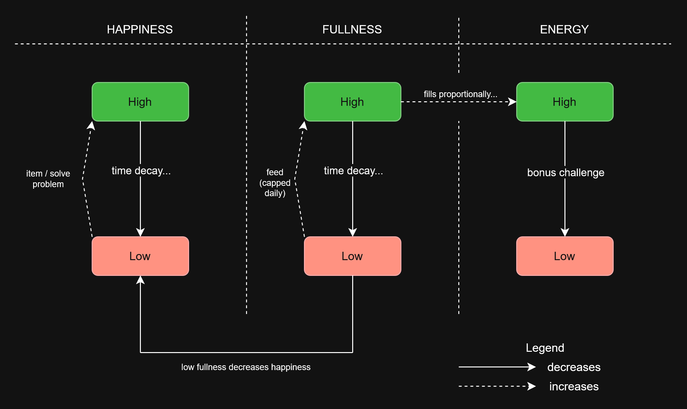
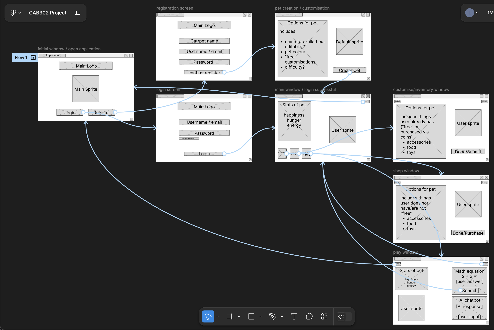

# Technical Requirements

## 1. Overview

High-level overview of the project purpose is outlined in the project [README.md](https://github.com/RedNate22/CAB302-Oogly-Boogly/blob/main/README.md).

### 1.1 Gameplay Loop

#### 1.1.1 Pet Stats

- **Happiness** – Measures the pet’s emotional state. Increases through interactions via items (e.g., brush, catnip, toys etc.), continously solving problems, and gradually decreases over **real-world time** to encourage regular engagement. Additionally, Happiness decreases when Fullness is low.
- **Fullness** – Tracks how well the pet has been fed. Feeding increases Fullness, which also restores Energy proportionally. Depletes over **real-world time** as it does with Happiness, and cannot exceed its maximum value, preventing repeated feeding for infinite Energy gains.
- **Energy** – Represents how active the pet is. Depletes each time the user solves a problem. When Energy reaches zero, the user can still attempt problems but receives no items or XP as rewards. Regenerates automatically at a rate proportional to current Fullness, subject to a daily cap of 100, resetting each calendar day. Can also be restored via specific items.

#### 1.1.2 Cat Level System

- Users earn **XP** by completing math problems.
- Level progression unlocks:
    - Higher problem difficulty (e.g., Level 2 problems require cat to be at or above Level 2)
    - Increased item rewards from problems

#### 1.1.3 Solving Math Problems

- Completing problems rewards **items + XP**.
- Rewards are only given when the cat has Energy remaining; once Energy is depleted for the day, problems can still be attempted but yield no rewards.
- Rewards scale with difficulty:
    - Easy: +5 Energy spent, base item/XP reward
    - Medium: +10 Energy spent, increased reward
    - Hard: +20 Energy spent, highest reward
- Items earned can **restore Energy, increase Happiness, or satisfy Fullness**.

#### 1.1.4 Bonus Challenges *(Out of Scope)*

Moved out of scope. Energy-based bonus challenge system has been replaced by the daily Energy cap on rewards (see 1.1.3).

#### 1.1.5 Shop *(Out of Scope)*

Moved out of scope. Currency and item purchasing system deferred. Items are earned exclusively through solving problems.

### 1.2 Scope

#### In Scope

- Virtual pet interaction system
- Core actions: Feeding, playing, petting (via item use)
- Dynamic pet behaviour system driven by internal need states (Happiness, Fullness, Energy) with real-time decay and offline catch-up
- Math problem generation and validation (addition, subtraction, multiplication across Easy/Medium/Hard difficulties)
- Daily Energy cap to limit rewards and encourage spaced learning
- User feedback and progression (XP, levelling)
- AI chatbot helper using an "I do, we do, you do" guided approach (guides toward answers without giving them directly)
- All cosmetic customisation options available from account creation, changeable at any time

#### Out of Scope

- Item shop and currency system
- Bonus challenges (energy-gated higher-difficulty problems)
- Advanced mathematics beyond defined difficulty levels
- Additional subjects (e.g. Science, History, English/Languages etc.)
- Multiplayer or social features
- Additional external integrations (e.g., browser support)
- Android/iOS support

---

## 2. System Description

### 2.1 High Level Architecture

**Overview**  
The system uses a layered architecture. Core components include:

1. **Presentation Layer**
    - **UI**: Renders the interface and handles user input.
    - **FXML & CSS**: Define layout and styling.
    - UI communicates bidirectionally with Controllers.

2. **Controller Layer**
    - **Controller (.java)**: Handles user events, triggers pet actions, and manages the AI Chatbot window.
    - Controllers communicate bidirectionally with both the UI and Business Logic.
    - Controllers also communicate bidirectionally with the AI Chatbot Module.

3. **Business Logic Layer**
    - Implements game rules, math challenges, reward calculations, and interaction logic.
    - Interfaces with the Pet State Machine, AI Chatbot Module, and Database.
    - Can also query external APIs for math problems or datasets if integrated.

4. **Pet State Machine**
    - Tracks the cat’s internal states (Happiness, Energy, Fullness, Level, etc.).
    - Updates behaviour deterministically based on user interactions and time-based decay.

5. **AI Chatbot Module**
    - Optional, user-invoked guidance using the [Socratic method](https://en.wikipedia.org/wiki/Socratic_method).
    - Generates hints/questions rather than direct answers.
    - Queries Business Logic Layer for current problem context or progress.
    - Interacts bidirectionally with Controllers for display and user input.

6. **Data Access Layer**
    - Handles persistent storage of user accounts, pet state, items, and other application data.

7. **Database**
    - Stores all persistent data, including user progress, pet attributes, and inventory.

### 2.2 Component Interaction

    - User actions -> UI <-> Controllers -> Business Logic -> Pet State Machine updates state.
    - Business Logic provides context -> AI Chatbot <-> Controllers -> UI updates.
    - Business Logic -> Database Layer -> Database for all persistence.
    - Optional API requests (e.g., math problem dataset) are queried by Business Logic or AI Chatbot.

### 2.3 Component Diagram

Created by [Colin](https://github.com/Ka-319)

### 2.4 State Machine Diagram (Pet Stats)

Created by [Nathan](https://github.com/RedNate22)

### 2.5 Wireframes of Project (Screens + Flow)

Created by [Leonora](https://github.com/smolbebby)

### 2.6 Technology Stack

- Language: Java 21 (Amazon Corretto 21)
- Frameworks: JavaFX 21.0.6
- Build Tool: Maven
- Database: SQLite (via `sqlite-jdbc` 3.45.1.0)
- Unit Testing: [JUnit 5](https://docs.junit.org/5.10.5/user-guide/) 5.12.1
- Other Dependencies:
    - [FormsFX](https://github.com/dlsc-software-consulting-gmbh/FormsFX/) 11.6.0 - form building utilities
    - [FXGL](https://github.com/AlmasB/FXGL) 17.3 - game framework utilities
    - [Ikonli](https://kordamp.org/ikonli/) 12.3.1 - icon packs for JavaFX
    - [Gson](https://github.com/google/gson) 2.10.1 - JSON parsing for AI API responses
    - [dotenv-java](https://github.com/cdimascio/dotenv-java) 3.2.0 - loading API keys from `.env`
    - `java.net.http` (JDK built-in) - HTTP client for AI API calls
    - `slf4j-nop` 1.7.36 - suppresses SQLite JDBC logging output

### 2.7 Deployment Environment

- OS: Windows, MacOS
- CI/CD: Github Actions

---

## 3. Functional Requirements

### 3.1 User Authentication

- Create Account: User needs to be able to register their details (username, email, password) to create an account.
- Login: User needs to be able to use registered username or email with password (key pair) to login to the application.
- Logout: User needs to be able to log out so progress is protected on shared devices.
- Account Storage: User needs to have in-game progress saved to account for continuous access.

### 3.2 User Interface

- Pet Display: User needs to be able to clearly view virtual pet on the main screen.
- Pet Attribute: User needs to be able to clearly view virtual pet attributes.
- Layout: User needs to be able to access different areas of the application to interact with virtual pet.
- Navigation: User needs to be able to use buttons and other appropriate functions to access separate areas of the application.
- Navigation Continued: User needs to be able to use buttons and other appropriate functions to interact with the virtual pet.
- Input Validation Registration fields must validate format such as valid email, minimum password length.
- Incorrect Details: User should be told when login credentials are incorrect.

### 3.3 User Experience

- Level Progression: Clear indicator for current level and progress towards the next
- Level up Notification User should receive a notification when pets level up.

### 3.4 Math Learning System

- Progress Recording: User's math performance should be tracked to adapt difficulty or provide suggestions.
- Rewards: User should earn rewards or points for completing math exercises, which can affect the virtual pet’s happiness or growth.

### 3.5 Data Persistence

- Data Saving: Every interaction with the virtual pet is recorded and saved to prevent data loss.
- Inventory Persistence: The user's item inventory must be saved and restored between sessions.

---

## 4. Non-functional Requirements

### 4.1 User Authentication

- Account Security: User details need to be stored securely to prevent unauthorised access.
- Duplicate Registration: The system must prevent registration with a username or email that is already associated with an existing account.
- Password Requirements: Passwords must meet a minimum complexity requirement

### 4.2 User Interface

- Accessibility: Buttons should be clearly labelled for accessibility and ease-of-use.
- Layout: Layout should be organised and easily readable to prevent confusion and difficulty navigating.

### 4.3 User Experience

- Feedback: User should receive immediate feedback on pet interactions.
- Performance The application should run smoothly without noticeable lag.
- Accessibility Buttons should be clearly labelled for accessibility and ease of use.
- UI Consistency components such as fonts, colors, button styles should remain consistent across all screens.

### 4.4 Math Learning System

- Adaptability The learning system should adjust difficulty based on user performance.
- Answer Accuracy The answer validation system must correctly evaluate all expected problem types without error.
- Problem Variety The system should generate varied problem types at each difficulty level to prevent repetitive or predictable question patterns.
- Answer Validation User's submitted answer must be evaluated and marked correct or incorrect with immediate feedback.

### 4.5 Data Persistence

- Reliability All game state and user progress must be saved after every meaningful interaction with no data loss on normal exit.
- Integrity The database must maintain consistent state at all times; partial writes must not corrupt saved data.
- Consistency Inventory, pet stats, and level progress must all remain in sync

---

## 5. Maintainability

### 5.1 Code Standards

- **Separation of Concerns**
    - **FXML**: Define UI structure only. Avoid in-line styling unless absolutely necessary.
    - **CSS**: Define styling with classes/IDs to maintain consistency.
    - **Controller (.java)**: Handle UI behaviour, event handling, and interaction with the model/data.
    - **Other .java files**: Contain main application logic, APIs, and database interactions.
    - **Assets**: Images, icons, and other resources organised in dedicated folders with sub-folders.

- **Security, Validation, and Error Handling**
    - Sanitise user input to prevent invalid data or security issues.
    - Implement proper exception handling with `try/catch`. Use `throws` only when passing responsibility is intentional.
    - Provide fallback behaviour (e.g., return to main menu) on failures.

- **Naming Conventions**
    - **Classes**: PascalCase (e.g., `VirtualPetController`)
    - **Methods / Properties**: camelCase (e.g., `feedPet()`, `petName`)
    - **Variables / Parameters / Properties**: camelCase (e.g., `petAge`, `mathProblem`)
    - **Private Fields (Attributes)**: camelCase (e.g., `petHealth`)
    - **Interfaces**: PascalCase with `I` prefix if applicable (e.g., `IQuestion`)
    - **Constants / Readonly Fields**: UPPERCASE, or UPPERCASE + underscores (e.g., `HUNGER`, `MAX_HUNGER`)
    - **Events**: PascalCase with `EventHandler` suffix if applicable (e.g., `PetFedEventHandler`)

- **Branching and Version Control**
    - Use separate branches for each feature or issue (e.g., `user-login`, `issue-6-broken-landing-page`).
    - Submit pull requests for merges.
    - Follow [conventional commit standards](https://www.conventionalcommits.org/en/v1.0.0/) with `type(optional scope): description` (e.g., `git commit -m "feat(auth): add login button to landing page"`)
        - (Optional) include detailed bodies (e.g, `git commit -m -m "feat(auth): add login button to landing page" "Add small login button to landing page header...etc."`)

- **Formatting and Readability**
    - Maintain consistent indentation and spacing.
    - Organise code logically for readability and maintainability.
        - Separate logical blocks with empty lines

### 5.2 Documentation requirements

#### Code Documentation

- Use [JavaDoc](https://www.geeksforgeeks.org/java/what-is-javadoc-tool-and-how-to-use-it/) comments for all public classes and methods.
    - Include `@param`, `@return`, and `@throws` where applicable.
- Use inline comments to explain:
    - Complex logic
    - Non-obvious decisions or edge cases
- Avoid redundant comments that restate obvious code behaviour.
- Keep all comments accurate and update them alongside code changes.
- Maintain consistent formatting and style for all documentation.

#### Project Documentation

- Maintain a **Technical Requirements Document** with epics, user stories, architecture diagrams, and non-functional requirements.
- Maintain a **README** with:
    - Project overview
    - Setup instructions
    - Core functionality summary
- Maintain a **Changelog** or version history for major updates and feature additions.

---
